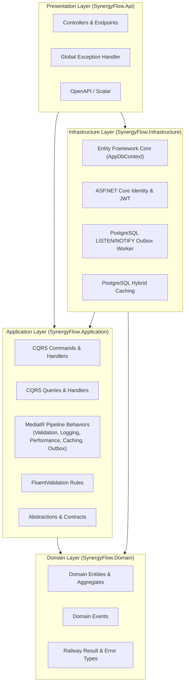

# SynergyFlow API (`synergyflow-labs/api`)

[](https://dotnet.microsoft.com/)
[](LICENSE)
[](#architecture-overview)
[](#test-suite--verification)

A production-grade, enterprise-ready **Clean Architecture** template for .NET
10+, synthesized with modern software engineering practices: CQRS with MediatR,
FluentValidation, PostgreSQL Transactional Outbox with real-time
`LISTEN`/`NOTIFY`, Hybrid Caching, ASP.NET Core Identity with JWT & Refresh
Token Rotation, OpenAPI 3.0 / Scalar, Central Package Management (CPM), and an
automated test suite spanning Unit, Subcutaneous, Architecture, and
Testcontainers Integration tests.

---

## Table of Contents

- [Architecture Overview](#architecture-overview)
- [Project & Folder Structure Guide](#project--folder-structure-guide)
  - [src/SynergyFlow.Domain](#srcsynergyflowdomain)
  - [src/SynergyFlow.Application](#srcsynergyflowapplication)
  - [src/SynergyFlow.Infrastructure](#srcsynergyflowinfrastructure)
  - [src/SynergyFlow.Api](#srcsynergyflowapi)
  - [tests/](#tests)
- [Key Architectural Features](#key-architectural-features)
  - [CQRS & MediatR Pipeline Behaviors](#cqrs--mediatr-pipeline-behaviors)
  - [Railway-Oriented Result Pattern](#railway-oriented-result-pattern)
  - [PostgreSQL LISTEN/NOTIFY Outbox](#postgresql-listennotify-outbox)
  - [Central Package Management & Build Governance](#central-package-management--build-governance)
- [Getting Started](#getting-started)
  - [Prerequisites](#prerequisites)
  - [Starting the Infrastructure](#starting-the-infrastructure)
  - [Running the API](#running-the-api)
  - [Default Seed Accounts](#default-seed-accounts)
- [How to Use As a Template](#how-to-use-as-a-template)
  - [Option A: Using dotnet new (Recommended)](#option-a-using-dotnet-new-recommended)
  - [Option B: Using the Interactive Shell Script](#option-b-using-the-interactive-shell-script)
- [Test Suite & Verification](#test-suite--verification)
- [Contributing & Best Practices](#contributing--best-practices)

---

## Architecture Overview

This template adheres strictly to the **Clean Architecture (Dependency Rule)**:
inner layers define business logic and domain entities, and outer layers depend
only inward toward abstractions.



### Dependency Inversion Rules Enforced by Architecture Tests

1. **`Domain`** has **ZERO** external project dependencies. It does not
   reference EF Core, ASP.NET Core, or Infrastructure.
2. **`Application`** depends **ONLY** on `Domain`. It defines interfaces
   (`IAppDbContext`, `IAuthService`, `IUser`) implemented by outer layers.
3. **`Infrastructure`** depends on `Application` and `Domain`. It implements
   databases, file storage, email providers, and third-party integrations.
4. **`Api`** coordinates dependency injection and exposes HTTP endpoints
   (Controllers and Minimal APIs).

---

## Project & Folder Structure Guide

Every folder in this repository has an intentional, single responsibility. Below
is the comprehensive guide on what each folder is used for and how to use it.

```text
synergyflow-api/
├── .github/workflows/          # CI/CD pipelines (GitHub Actions)
├── .husky/                     # Git pre-commit hooks (formatting & linting)
├── .template.config/           # 'dotnet new' template metadata
├── src/
│   ├── SynergyFlow.Domain/        # Core business models, entities & domain rules
│   ├── SynergyFlow.Application/   # CQRS features, pipeline behaviors & use cases
│   ├── SynergyFlow.Infrastructure/# EF Core, Identity, external services & jobs
│   └── SynergyFlow.Api/           # API controllers, endpoints, OpenAPI & Program.cs
└── tests/
    ├── SynergyFlow.ArchitectureTests/         # Automated NetArchTest architecture guardrails
    ├── SynergyFlow.Domain.UnitTests/          # Pure domain logic & entity invariant tests
    ├── SynergyFlow.Application.UnitTests/     # Pipeline behaviors & unit logic tests
    ├── SynergyFlow.Application.SubcutaneousTests/ # MediatR command tests with real DB
    ├── SynergyFlow.Api.IntegrationTests/      # HTTP end-to-end integration tests
    └── SynergyFlow.Tests.Common/              # Shared test fixtures, factories & test users
```

---

### `src/SynergyFlow.Domain`

_The enterprise business rules layer. Contains entities, value objects, domain
events, and universal business errors._

| Folder / File          | Purpose & Usage Guide                                                                                                                                                                                            |
| :--------------------- | :--------------------------------------------------------------------------------------------------------------------------------------------------------------------------------------------------------------- |
| **`Common/`**          | Contains foundational base classes and types shared across the entire domain.                                                                                                                                    |
| ├── `Entity.cs`        | Base aggregate root class containing `Id`, audit timestamps (`CreatedOnUtc`, `ModifiedOnUtc`), and the domain event collection (`AddDomainEvent`, `ClearDomainEvents`). All business entities inherit from this. |
| ├── `DomainEvent.cs`   | Abstract record for all in-process domain events. Implements MediatR `INotification` with an automatic `Id` and `OccurredOnUtc`.                                                                                 |
| ├── `OutboxMessage.cs` | Entity model representing the transactional outbox table (`Id`, `OccurredOnUtc`, `Type`, `Content`, `ProcessedOnUtc`, `Error`).                                                                                  |
| └── `Results/`         | **Railway-Oriented Result Pattern**. Contains `Result<TValue>`, `Result`, `Error`, and `ErrorKind`. Eliminates exception-driven control flow for predictable business validation failures.                       |
| **`Entities/`**        | Contains business aggregate roots and entities grouped by business domain.                                                                                                                                       |
| ├── `Identity/`        | Domain representations for authentication models, such as `UserRefreshToken.cs` for JWT token rotation.                                                                                                          |
| └── `Products/`        | **Sample Feature**: Demonstrates a rich DDD aggregate root (`Product.cs`) with private parameterless constructors, encapsulated business methods (`UpdateDetails`, `AdjustStock`), and business invariants.      |

---

### `src/SynergyFlow.Application`

_The application use cases layer. Orchestrates business workflows using CQRS,
MediatR, and FluentValidation._

| Folder / File                | Purpose & Usage Guide                                                                                                                                                                                                                                                                                                                                                                                                                                                                                                                                                                                                     |
| :--------------------------- | :------------------------------------------------------------------------------------------------------------------------------------------------------------------------------------------------------------------------------------------------------------------------------------------------------------------------------------------------------------------------------------------------------------------------------------------------------------------------------------------------------------------------------------------------------------------------------------------------------------------------ |
| **`Common/`**                | Reusable infrastructure abstractions and pipeline behaviors for application workflows.                                                                                                                                                                                                                                                                                                                                                                                                                                                                                                                                    |
| ├── `Behaviours/`            | **MediatR Pipeline Behaviors** executed for every request: <br>• `ValidationBehavior.cs`: Automatically runs FluentValidation rules before handlers.<br>• `LoggingBehaviour.cs`: Structured logging with execution duration.<br>• `PerformanceBehaviour.cs`: Emits warnings if request execution exceeds 500ms.<br>• `UnhandledExceptionBehaviour.cs`: Catches unhandled exceptions and logs context.<br>• `CachingBehavior.cs`: Automatically caches query responses implementing `ICachedQuery`.<br>• `DomainEventsPublishingBehavior.cs`: Extracts domain events from entities and tracks them for outbox persistence. |
| ├── `Caching/`               | Caching abstractions (`ICachedQuery.cs`, `ICacheInvalidator.cs`) and cache policy constants (`CachePolicies.cs`).                                                                                                                                                                                                                                                                                                                                                                                                                                                                                                         |
| ├── `Errors/`                | `ApplicationErrors.cs` defines standardized application-level errors (e.g., `InvalidCredentials`, `UserNotFound`).                                                                                                                                                                                                                                                                                                                                                                                                                                                                                                        |
| ├── `Events/`                | `IDomainEventTracker.cs` interface to track domain events during request handling.                                                                                                                                                                                                                                                                                                                                                                                                                                                                                                                                        |
| ├── `Interfaces/`            | Abstract contracts implemented by Infrastructure: `IAppDbContext.cs`, `IAuthService.cs`, `IUser.cs`. Handlers inject these interfaces, never concrete infrastructure classes.                                                                                                                                                                                                                                                                                                                                                                                                                                             |
| ├── `Models/`                | Shared DTOs and utilities, including `PaginatedList<T>.cs` for standardized pagination metadata (`PageNumber`, `TotalPages`, `TotalCount`, `Items`).                                                                                                                                                                                                                                                                                                                                                                                                                                                                      |
| └── `Validation/`            | Custom FluentValidation extension rules and helpers.                                                                                                                                                                                                                                                                                                                                                                                                                                                                                                                                                                      |
| **`Features/`**              | **Vertical Slice Feature Folders**. Grouped by business capability (e.g., `Auth`, `Products`).                                                                                                                                                                                                                                                                                                                                                                                                                                                                                                                            |
| └── `Features/Products/`     | • `Commands/`: Write operations (e.g., `CreateProductCommand`, `CreateProductCommandHandler`, `CreateProductCommandValidator`).<br>• `Queries/`: Read operations (e.g., `GetProductByIdQuery`, `GetProductsQuery`).<br>• `DTOs/`: Data transfer contracts returned by queries.<br>• `Mappers/`: Pure mapping extensions (`ProductMapper.cs`) translating domain models to DTOs.                                                                                                                                                                                                                                           |
| **`DependencyInjection.cs`** | Registers MediatR, pipeline behaviors in priority order, FluentValidation validators from assembly, and application services.                                                                                                                                                                                                                                                                                                                                                                                                                                                                                             |

---

### `src/SynergyFlow.Infrastructure`

_The technology and external services layer. Implements persistence,
authentication, caching, and background jobs._

| Folder / File                | Purpose & Usage Guide                                                                                                                                                                                                                               |
| :--------------------------- | :-------------------------------------------------------------------------------------------------------------------------------------------------------------------------------------------------------------------------------------------------- |
| **`Data/`**                  | Entity Framework Core persistence setup.                                                                                                                                                                                                            |
| ├── `AppDbContext.cs`        | Unified EF Core context inheriting from `IdentityDbContext<AppUser>`. Overrides `SaveChangesAsync` to atomically persist entities and convert tracked `IDomainEvent`s into `OutboxMessages` within the same database transaction.                   |
| ├── `Configurations/`        | Fluent API entity configurations (`ProductConfiguration.cs`, `UserRefreshTokenConfiguration.cs`). Keeps `AppDbContext` clean and adheres to single-responsibility principles.                                                                       |
| ├── `DbInitializer.cs`       | Database migration runner and seeder. Automatically applies pending EF migrations (with `EnsureCreated` fallback), configures PostgreSQL `LISTEN`/`NOTIFY` triggers, and seeds default roles and admin/user accounts.                               |
| └── `Migrations/`            | EF Core code-first migration snapshots.                                                                                                                                                                                                             |
| **`BackgroundJobs/`**        | Long-running and recurring background tasks.                                                                                                                                                                                                        |
| └── `OutboxProcessorJob.cs`  | `BackgroundService` that uses PostgreSQL `LISTEN outbox_channel` to wake up instantly when a new event is saved, falling back to a periodic timer. Employs `FOR UPDATE SKIP LOCKED` for scale-out safe processing across multiple worker instances. |
| **`Caching/`**               | Implementations of caching abstractions, such as `CacheInvalidator.cs` utilizing hybrid / PostgreSQL distributed cache.                                                                                                                             |
| **`Identity/`**              | Authentication and authorization implementation.                                                                                                                                                                                                    |
| ├── `AppUser.cs`             | Extended ASP.NET Core `IdentityUser` with custom profile properties (e.g., `FullName`, `CreatedOnUtc`).                                                                                                                                             |
| └── `AuthService.cs`         | Implements `IAuthService` using `UserManager<AppUser>`, generating secure HMAC-SHA256 JWT tokens and cryptographically random refresh tokens.                                                                                                       |
| **`Settings/`**              | Strongly typed configuration options mapped to `appsettings.json` sections (`PostgresSettings`, `JwtSettings`, `CorsSettings`, `RateLimiterSettings`, `IdentitySettings`).                                                                          |
| **`DependencyInjection.cs`** | Registers EF Core PostgreSQL context, Identity, JWT Bearer authentication, rate limiters, caching, and background services.                                                                                                                         |

---

### `src/SynergyFlow.Api`

_The presentation entry point. Exposes HTTP endpoints, configures middleware,
and defines OpenAPI schemas._

| Folder / File                   | Purpose & Usage Guide                                                                                                                                                       |
| :------------------------------ | :-------------------------------------------------------------------------------------------------------------------------------------------------------------------------- |
| **`Controllers/`**              | Standard REST controllers inheriting from `ApiController.cs`. Provides traditional controller-based routing alongside minimal APIs.                                         |
| ├── `ApiController.cs`          | Base controller providing `HandleResult<T>()`, which maps domain `Result<T>` and `ErrorKind` directly to appropriate HTTP status codes (200, 201, 400, 401, 403, 404, 409). |
| ├── `AuthController.cs`         | Endpoints for `/api/v1/auth/login` and `/api/v1/auth/refresh-token`.                                                                                                        |
| └── `ProductsController.cs`     | Endpoints for `/api/v1/products` (CRUD operations with pagination, caching, and role-based authorization).                                                                  |
| **`Endpoints/`**                | **Minimal API alternative**. Shows how to implement endpoints with C# extension methods (`AuthEndpoints.cs`, `ProductEndpoints.cs`) and `ResultExtensions.cs`.              |
| **`DTOs/Requests/`**            | Request payloads accepted by API controllers/endpoints (e.g., `LoginRequest`, `CreateProductRequest`).                                                                      |
| **`Infrastructure/`**           | Presentation middleware and cross-cutting concerns.                                                                                                                         |
| └── `GlobalExceptionHandler.cs` | Implements ASP.NET Core `IExceptionHandler` to produce RFC 7807 `ProblemDetails` for uncaught runtime exceptions, hiding stack traces in production.                        |
| **`OpenApi/`**                  | OpenAPI / Swagger schema enhancements.                                                                                                                                      |
| └── `Transformers/`             | Document and operation transformers: `BearerSecuritySchemeTransformer.cs` (adds JWT lock icon to Scalar UI), `VersionInfoTransformer.cs`.                                   |
| **`Services/`**                 | Presentation implementations of application interfaces, such as `CurrentUser.cs` extracting claims from `IHttpContextAccessor`.                                             |
| **`Program.cs`**                | Application bootstrapping: Serilog configuration, rate limiting, CORS, database initialization on startup, OpenTelemetry, and Scalar UI mapping (`/scalar/v1`).             |

---

### `tests/`

_Automated test suites ensuring architecture compliance, unit correctness, and
end-to-end integration._

| Test Project                                     | Purpose & Testing Strategy                                                                                                                                                                                                                    |
| :----------------------------------------------- | :-------------------------------------------------------------------------------------------------------------------------------------------------------------------------------------------------------------------------------------------- |
| **`SynergyFlow.ArchitectureTests/`**             | Enforces layer boundaries using `NetArchTest.Rules`. Verifies that Domain never references outer layers, handlers end with `Handler`, and validators end with `Validator`.                                                                    |
| **`SynergyFlow.Domain.UnitTests/`**              | Tests pure business rules and entity invariants without mocks or external dependencies.                                                                                                                                                       |
| **`SynergyFlow.Application.UnitTests/`**         | Unit tests for MediatR pipeline behaviors (`ValidationBehavior`, `LoggingBehaviour`, `UnhandledExceptionBehaviour`) and mapping extensions.                                                                                                   |
| **`SynergyFlow.Application.SubcutaneousTests/`** | **Subcutaneous (just-under-the-skin) tests**. Sends commands and queries directly to `IMediator` against a real PostgreSQL Testcontainers database to verify full handler logic, validation, and outbox event creation without HTTP overhead. |
| **`SynergyFlow.Api.IntegrationTests/`**          | End-to-end HTTP integration tests using `CustomWebApplicationFactory` and real PostgreSQL Testcontainers. Tests authentication, authorization status codes (401, 403), controller routing, and response schemas.                              |
| **`SynergyFlow.Tests.Common/`**                  | Reusable test helpers: `TestCurrentUser` (with `AsyncLocal` state), `TestUsers` (mock admin/user credentials), and `ProductFactory`.                                                                                                          |

---

## Key Architectural Features

### CQRS & MediatR Pipeline Behaviors

All business operations are segregated into **Commands** (writes) and
**Queries** (reads). Requests flow through a deterministic pipeline:

```text
Incoming Request
       │
       ▼
┌───────────────────────────────┐
│ 1. LoggingBehaviour           │ -> Emits structured execution logs
└──────────────┬────────────────┘
               ▼
┌───────────────────────────────┐
│ 2. UnhandledExceptionBehavior │ -> Catches & logs unhandled exceptions
└──────────────┬────────────────┘
               ▼
┌───────────────────────────────┐
│ 3. PerformanceBehaviour       │ -> Flags slow requests (>500ms)
└──────────────┬────────────────┘
               ▼
┌───────────────────────────────┐
│ 4. ValidationBehavior         │ -> Validates with FluentValidation; short-circuits on failure
└──────────────┬────────────────┘
               ▼
┌───────────────────────────────┐
│ 5. CachingBehavior            │ -> Checks HybridCache if request is ICachedQuery
└──────────────┬────────────────┘
               ▼
┌───────────────────────────────┐
│ 6. DomainEventsPublishing     │ -> Collects entity domain events & tracks for Outbox
└──────────────┬────────────────┘
               ▼
┌───────────────────────────────┐
│ 7. Command / Query Handler    │ -> Executes business logic & updates DbContext
└───────────────────────────────┘
```

### Railway-Oriented Result Pattern

Rather than throwing exceptions for business errors, methods return
`Result<TValue>`:

```csharp
public Result<Product> UpdatePrice(decimal newPrice)
{
    if (newPrice <= 0)
    {
        return ProductErrors.NegativePrice;
    }

    Price = newPrice;
    return this;
}
```

The `ApiController` or `ResultExtensions` maps the `Result` seamlessly to HTTP
responses:

```csharp
return result.Match(
    onSuccess: product => Ok(product),
    onFailure: errors => Problem(errors)
);
```

### PostgreSQL LISTEN/NOTIFY Outbox

For reliable asynchronous messaging and event publication:

1. When `AppDbContext.SaveChangesAsync()` is called, all domain events attached
   to modified entities are converted into `OutboxMessage` rows in the same
   transaction.
2. A PostgreSQL trigger executes `pg_notify('outbox_channel', NEW."Id")`.
3. `OutboxProcessorJob` receives the notification immediately and queries
   unprocessed messages using `FOR UPDATE SKIP LOCKED`.
4. The worker processes the event and stamps `ProcessedOnUtc`.

### Central Package Management & Build Governance

- **`Directory.Packages.props`**: Manages all NuGet package versions in a single
  root file
  (`<ManagePackageVersionsCentrally>true</ManagePackageVersionsCentrally>`).
  Individual `.csproj` files reference packages without specifying versions.
- **`Directory.Build.props`**: Enforces strict compiler rules across all
  projects:
  - `<TreatWarningsAsErrors>true</TreatWarningsAsErrors>`
  - `<Nullable>enable</Nullable>`
  - StyleCop analyzers enabled with customized rules.

---

## Getting Started

### Prerequisites

- [.NET 10.0 SDK](https://dotnet.microsoft.com/download) (or .NET 11 preview
  with roll-forward enabled)
- [Docker & Docker Compose](https://docs.docker.com/get-docker/)

### Starting the Infrastructure

Start PostgreSQL, Seq (structured log viewer), and Grafana Loki using Docker
Compose:

```bash
docker compose up -d
```

| Service             | Address                 | Default Credentials                             |
| :------------------ | :---------------------- | :---------------------------------------------- |
| **PostgreSQL 18.3** | `localhost:5432`        | `postgres` / `postgres` (DB: `synergyflow_dev`) |
| **Seq UI**          | `http://localhost:5341` | No authentication required                      |
| **Grafana**         | `http://localhost:3000` | `admin` / `admin`                               |

### Running the API

```bash
dotnet run --project src/SynergyFlow.Api
```

- **Scalar Interactive API Documentation**: Navigate to
  [http://localhost:5000/scalar/v1](http://localhost:5000/scalar/v1)
- **OpenAPI JSON**:
  [http://localhost:5000/openapi/v1.json](http://localhost:5000/openapi/v1.json)
- **Health Checks**:
  [http://localhost:5000/health](http://localhost:5000/health)

### Default Seed Accounts

The template automatically creates the database schema, installs the outbox
trigger, and seeds the following demo users upon first run:

| Role      | Email                     | Password    |
| :-------- | :------------------------ | :---------- |
| **Admin** | `admin@synergyflow.local` | `Admin123!` |
| **User**  | `user@synergyflow.local`  | `User123!`  |

---

## How to Use As a Template

You can instantiate a brand-new project with your own company or service
namespace in two ways:

### Option A: Using `dotnet new` (Recommended)

1. **Install the template locally**:

   ```bash
   dotnet new install /path/to/clean-arc-dotnet-template
   ```

2. **Generate your new project**:

   ```bash
   dotnet new clean-arc -n MyCompany.OrderService
   cd MyCompany.OrderService
   ```

3. **Verify and build**:

   ```bash
   dotnet restore
   dotnet build
   dotnet test
   ```

4. **Uninstall the template when done**:

   ```bash
   dotnet new uninstall /path/to/clean-arc-dotnet-template
   ```

---

### Option B: Using the Interactive Shell Script

If you cloned or copied this repository directly, use the provided `init.sh`
script to rename all namespaces, projects, directories, and configuration
strings in one command:

```bash
# Syntax: ./init.sh <NewProjectName>
./init.sh MyCompany.CatalogService
```

The script will:

- Replace all occurrences of `SynergyFlow` with `MyCompany.CatalogService`.
- Update Docker Compose service and database names to lowercase.
- Rename all `.csproj`, `.slnx`, and source files.
- Rename all project directories.

---

## Test Suite & Verification

The solution comes with 32 automated tests across all Clean Architecture layers:

```bash
dotnet test SynergyFlow.slnx
```

### Test Breakdown

```text
Test Run Summary:
-------------------------------------------------------------------------------
✓ SynergyFlow.ArchitectureTests            (5 passed,  0 failed)
  ├── Domain_Should_Not_HaveDependencyOnOtherProjects
  ├── Application_Should_Not_HaveDependencyOnInfrastructureOrApi
  ├── Infrastructure_Should_Not_HaveDependencyOnApi
  ├── CommandAndQueryHandlers_Should_EndWithHandler
  └── Validators_Should_EndWithValidator

✓ SynergyFlow.Domain.UnitTests             (9 passed,  0 failed)
  ├── Create_WithValidParameters_ReturnsSuccessResult
  ├── Create_WithEmptyName_ReturnsValidationError
  ├── Create_WithEmptySku_ReturnsValidationError
  ├── Create_WithNegativePrice_ReturnsValidationError
  ├── Create_WithNegativeStock_ReturnsValidationError
  ├── UpdateDetails_WithValidData_UpdatesPropertiesAndSetsModifiedDate
  ├── UpdatePrice_WithNegativePrice_ReturnsValidationError
  ├── AdjustStock_WithValidQuantity_UpdatesStockQuantity
  └── AdjustStock_ResultingInNegativeQuantity_ReturnsValidationError

✓ SynergyFlow.Application.UnitTests        (7 passed,  0 failed)
  ├── ValidationBehavior_WithValidRequest_CallsNextDelegate
  ├── ValidationBehavior_WithValidationFailures_ReturnsResultWithErrors
  ├── LoggingBehaviour_LogsExecutionInformation
  ├── UnhandledExceptionBehaviour_WhenRequestThrows_LogsExceptionAndRethrows
  ├── ToDto_WithValidProduct_MapsAllProperties
  ├── ToListDto_WithValidProductList_MapsAllItems
  └── ToDto_WithNullProduct_ReturnsNull

✓ SynergyFlow.Application.SubcutaneousTests (3 passed, 0 failed)
  ├── Handle_WithValidCommand_PersistsProductAndCreatesOutboxMessage
  ├── Handle_WithDuplicateSku_ReturnsConflictError
  └── Handle_WithEmptyName_ShortCircuitsViaValidationBehavior

✓ SynergyFlow.Api.IntegrationTests         (8 passed,  0 failed)
  ├── Login_WithValidCredentials_Returns200WithJwtToken
  ├── Login_WithInvalidPassword_Returns401Unauthorized
  ├── RefreshToken_WithValidToken_ReturnsNewTokens
  ├── Create_WithoutAuth_Returns401Unauthorized
  ├── Create_AsUser_Returns403Forbidden
  ├── Create_AsAdmin_Returns201Created
  ├── GetById_WithNonExistingId_Returns404NotFound
  └── GetPaged_Returns200WithPaginatedProducts
-------------------------------------------------------------------------------
Total: 32 passed, 0 failed (100% pass rate)
```

---

## Contributing & Best Practices

1. **Keep the Domain Pure**: Never add database, HTTP, or framework packages to
   `SynergyFlow.Domain`.
2. **Follow CQRS Naming**: Name requests as verbs (`CreateProductCommand`,
   `GetProductByIdQuery`) and place validators adjacent to their commands.
3. **Use Subcutaneous Tests for Complex Workflows**: Before writing heavy HTTP
   tests, verify MediatR handlers using
   `SynergyFlow.Application.SubcutaneousTests` against Testcontainers.
4. **Use Central Package Management**: Add new packages or versions only in
   `Directory.Packages.props`.

---

## License

This template is licensed under the [MIT License](LICENSE).
